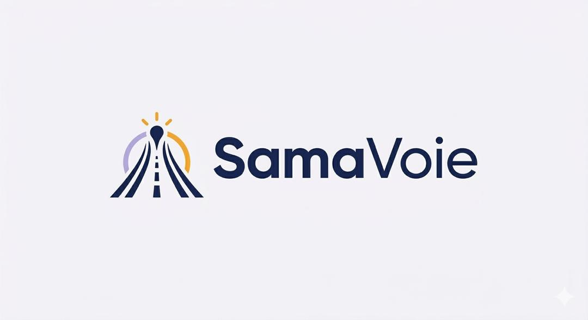

<p align="center">
  
</p>

<p align="center">
  
  
  
  
</p>

<p align="center">
  
  
  
</p>

---

# SamaVoie - API Backend

SamaVoie est une plateforme intelligente d'orientation académique dédiée aux élèves et étudiants sénégalais. Elle intègre **Kali AI**, un moteur de réponse basé sur une architecture RAG (Retrieval-Augmented Generation), capable de fournir des conseils personnalisés en s'appuyant sur une base de connaissances locale et officielle.

## Technologies Utilisées

SamaVoie repose sur une stack technique de pointe pour garantir performance et pertinence :

- **Framework Web** : FastAPI (Asynchrone, haute performance)
- **Cerveau IA (Kali AI)** : 
  - **LLM** : Gemma 4
  - **Embeddings** : BAAI/BGE-M3 (Local)
  - **Orchestration** : LangChain
- **Bases de Données** :
  - **Vectorielle** : ChromaDB
  - **Relationnelle** : PostgreSQL (SQLAlchemy 2.0)
- **Ingestion** : Gemini 1.5 Pro API (Extraction PDF)

## Installation

1. **Prérequis** :
   - Python 3.11 ou supérieur
   - PostgreSQL
   - Une clé API Gemini

2. **Cloner le projet et installer les dépendances** :
   ```bash
   pip install -r requirements.txt
   ```

3. **Configuration** :
   Copier le fichier `.env.example` vers un nouveau fichier `.env` et remplir les variables nécessaires :
   ```bash
   cp .env.example .env
   ```

4. **Lancement du serveur** :
   ```bash
   uvicorn app.main:app --reload
   ```

## Documentation

- [Guide d'Implémentation Technique](docs/IMPLEMENTATION.md) - Détails sur l'architecture et la roadmap.
- [Contexte Projet](docs/CONTEXT_BACK.md) - Vision globale et objectifs.

## Kali AI

Kali AI utilise une approche hybride pour l'orientation :
- **Extraction structurée** des PDF officiels (Guide GSA, rapports SAARA).
- **Recherche sémantique** asynchrone pour répondre aux questions en langage naturel.
- **Contextualisation** basée sur le profil de l'étudiant (niveau, série, intérêts).
